#  MERMAID DIAGRAM MASTERY
## The Complete Encyclopedia of Diagram-as-Code

### Version 2.0 | XIBS Documentation Series | 2025

---

<p align="center">
  
</p>

<p align="center">
  <strong>━━━━━━━━━━━━━━━━━━━━━━━━━━━━━━━━━━━━━━━━━━━━━━━━━━━━━━━━━━</strong><br>
  <strong>WRITE TEXT. GENERATE DIAGRAMS. DOCUMENT EVERYTHING.</strong><br>
  <strong>━━━━━━━━━━━━━━━━━━━━━━━━━━━━━━━━━━━━━━━━━━━━━━━━━━━━━━━━━━</strong>
</p>

---

## 📑 COMPLETE TABLE OF CONTENTS

| Section | Topic | Page |
|---------|-------|------|
| 1 | Foundations & Quick Start | 1 |
| 2 | Flowcharts (Graph) | 3 |
| 3 | Sequence Diagrams | 8 |
| 4 | Class Diagrams | 12 |
| 5 | State Diagrams | 16 |
| 6 | Entity Relationship (ER) | 19 |
| 7 | Git Graphs | 22 |
| 8 | Gantt Charts | 25 |
| 9 | Pie Charts | 28 |
| 10 | Mind Maps | 30 |
| 11 | Timeline Diagrams | 33 |
| 12 | Sankey Diagrams | 35 |
| 13 | XY Charts | 37 |
| 14 | C4 Architecture Diagrams | 39 |
| 15 | Requirement Diagrams | 43 |
| 16 | Block Diagrams | 45 |
| 17 | Quadrant Charts | 47 |
| 18 | User Journey Maps | 49 |
| 19 | Advanced Styling | 51 |
| 20 | Themes & Configuration | 54 |
| 21 | Mobile Application | 56 |
| 22 | Platform Support | 58 |
| 23 | Troubleshooting | 60 |
| 24 | Credits & Licensing | 62 |

---

# SECTION 1: FOUNDATIONS & QUICK START

## 1.1 WHAT IS MERMAID

Mermaid is a JavaScript-based diagramming tool that converts text descriptions into diagrams. Write code, get visuals. No dragging, no clicking — just type.

**Why Use Mermaid:**
- Diagrams live alongside code in markdown files
- Version control friendly (text-based)
- Renders natively on GitHub, GitLab, Notion
- No expensive tools required
## 1.2 THE CODE BLOCK WRAPPER

Every Mermaid diagram must be wrapped in triple backticks with `mermaid` as the language identifier.

**TEXT VIEW - Copy this code:**

    ```mermaid
    graph LR
        A[Start] --> B[End]
    ```

**ACTIVE VIEW - What it looks like:**

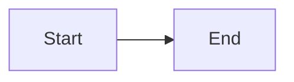

1.3 YOUR FIRST DIAGRAM

TEXT VIEW:

ACTIVE VIEW:

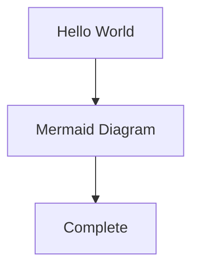

---

SECTION 2: FLOWCHARTS (GRAPH)

2.1 GRAPH DIRECTION TYPES

Flowcharts use graph followed by a two-letter direction code.

Direction TD (Top to Bottom)

TEXT VIEW:

ACTIVE VIEW:

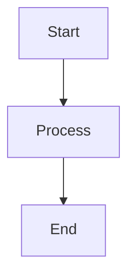

Direction LR (Left to Right)

TEXT VIEW:

ACTIVE VIEW:

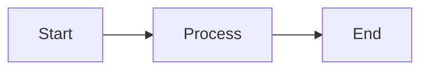

Direction RL (Right to Left)

TEXT VIEW:

ACTIVE VIEW:

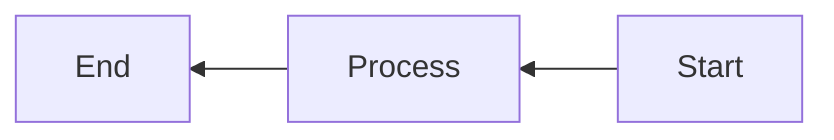

Direction BT (Bottom to Top)

TEXT VIEW:

ACTIVE VIEW:

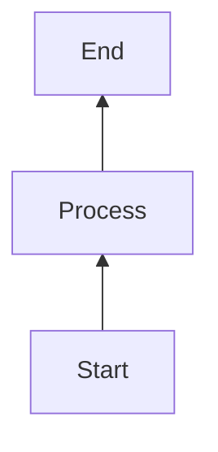

2.2 NODE SHAPES COMPLETE REFERENCE

Rectangle [Text]

TEXT VIEW:

ACTIVE VIEW:

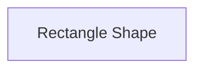

Rounded Rectangle (Text)

TEXT VIEW:

ACTIVE VIEW:

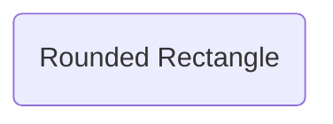

Stadium ([Text])

TEXT VIEW:

ACTIVE VIEW:

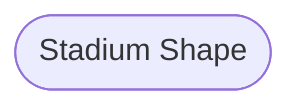

Circle ((Text))

TEXT VIEW:

ACTIVE VIEW:

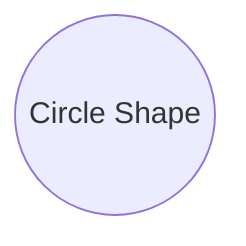

Diamond {Text}

TEXT VIEW:

ACTIVE VIEW:

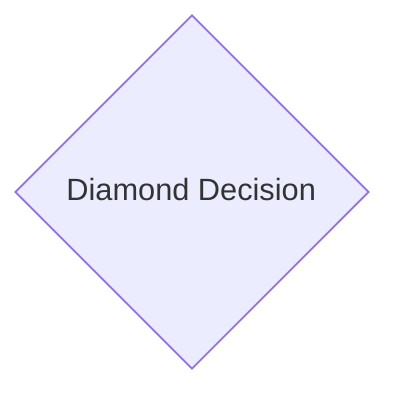

Hexagon {{Text}}

TEXT VIEW:

ACTIVE VIEW:

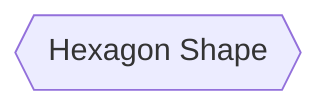

Trapezoid [/Text/]

TEXT VIEW:

ACTIVE VIEW:

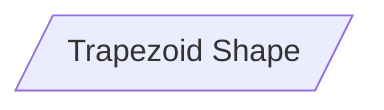

Reverse Trapezoid [\Text\]

TEXT VIEW:

ACTIVE VIEW:

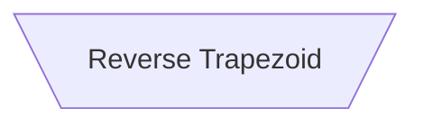

Cylinder [(Text)]

TEXT VIEW:

ACTIVE VIEW:

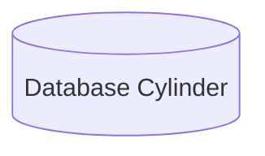

Asymmetric >Text]

TEXT VIEW:

ACTIVE VIEW:

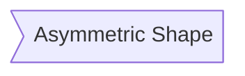

All Shapes Together

TEXT VIEW:

ACTIVE VIEW:


2.3 ARROW TYPES

Solid Arrow -->

TEXT VIEW:

ACTIVE VIEW:


Thick Arrow ==>

TEXT VIEW:

ACTIVE VIEW:

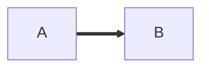

Dotted Arrow -.->

TEXT VIEW:

ACTIVE VIEW:


Arrow with Label -->|text|

TEXT VIEW:

ACTIVE VIEW:

```mermaid
graph LR
    A -->|Important| B
```

Two-Way Arrow <-->

TEXT VIEW:

ACTIVE VIEW:

```mermaid
graph LR
    A <--> B
```

Long Line ---

TEXT VIEW:

ACTIVE VIEW:

```mermaid
graph LR
    A --- B
```

All Arrow Types

TEXT VIEW:

ACTIVE VIEW:

```mermaid
graph LR
    A[Solid] --> B
    C[Thick] ==> D
    E[Dotted] -.-> F
    G[Labeled] -->|Text| H
    I[Two Way] <--> J
    K[Long] --- L
```

2.4 SUBGRAPHS (GROUPING)

TEXT VIEW:

ACTIVE VIEW:

```mermaid
graph TD
    subgraph Frontend
        A[Web App]
        B[Mobile App]
    end
    
    subgraph Backend
        C[API Gateway]
        D[Database]
    end
    
    A --> C
    B --> C
    C --> D
```

2.5 DECISION TREE EXAMPLE

TEXT VIEW:

ACTIVE VIEW:

```mermaid
graph TD
    Start([Start]) --> Input[/Enter Credentials/]
    Input --> Validate{Valid Credentials?}
    Validate -->|Yes| Dashboard[Dashboard]
    Validate -->|No| Error[Error Message]
    Error --> Input
    Dashboard --> End([End])
```

2.6 COMPLETE LOGIN FLOW

TEXT VIEW:

ACTIVE VIEW:

```mermaid
graph TD
    A[User Opens App] --> B{Has Account?}
    B -->|Yes| C[Enter Credentials]
    B -->|No| D[Sign Up Form]
    
    D --> E[Enter Details]
    E --> F[Verify Email]
    F --> C
    
    C --> G{Valid?}
    G -->|Yes| H[Login Success]
    G -->|No| I[Show Error]
    I --> C
    
    H --> J[Dashboard]
    J --> K[Use App]
```

---

SECTION 3: SEQUENCE DIAGRAMS

3.1 BASIC SEQUENCE DIAGRAM

TEXT VIEW:

ACTIVE VIEW:

```mermaid
sequenceDiagram
    Alice->>Bob: Hello!
    Bob-->>Alice: Hi there!
```

3.2 PARTICIPANTS

TEXT VIEW:

ACTIVE VIEW:

```mermaid
sequenceDiagram
    participant User
    participant Server
    participant Database
    
    User->>Server: Request
    Server->>Database: Query
    Database-->>Server: Result
    Server-->>User: Response
```

3.3 ACTIVATION (LIFELINES)

TEXT VIEW:

ACTIVE VIEW:

```mermaid
sequenceDiagram
    User->>+Server: Request
    Server->>+Database: Query
    Database-->>-Server: Result
    Server-->>-User: Response
```

3.4 NOTES

TEXT VIEW:

ACTIVE VIEW:

```mermaid
sequenceDiagram
    User->>Server: Request
    Note over User,Server: Authentication in progress
    Server-->>User: Response
    Note right of User: User receives response
```

3.5 LOOPS

TEXT VIEW:

ACTIVE VIEW:

```mermaid
sequenceDiagram
    User->>Server: Request
    loop Retry up to 3 times
        Server->>Database: Query
        Database-->>Server: Result
    end
    Server-->>User: Response
```

3.6 CONDITIONAL (ALT/ELSE)

TEXT VIEW:

ACTIVE VIEW:

```mermaid
sequenceDiagram
    User->>Server: Login Request
    alt Valid Credentials
        Server-->>User: Login Success
    else Invalid Credentials
        Server-->>User: Login Failed
    end
```

3.7 PARALLEL ACTIONS

TEXT VIEW:

ACTIVE VIEW:

```mermaid
sequenceDiagram
    User->>Server: Process Order
    
    par Payment Processing
        Server->>Payment: Charge Card
        Payment-->>Server: Confirmation
    and Inventory Check
        Server->>Warehouse: Check Stock
        Warehouse-->>Server: Available
    end
    
    Server-->>User: Order Complete
```

3.8 COMPLETE API FLOW

TEXT VIEW:

ACTIVE VIEW:

```mermaid
sequenceDiagram
    participant Client
    participant API Gateway
    participant Auth Service
    participant Database
    
    Client->>API Gateway: HTTP Request + JWT
    API Gateway->>Auth Service: Validate Token
    
    alt Token Valid
        Auth Service-->>API Gateway: User Info
        API Gateway->>Database: Query Data
        Database-->>API Gateway: Results
        API Gateway-->>Client: Response 200
    else Token Invalid
        Auth Service-->>API Gateway: Unauthorized
        API Gateway-->>Client: Error 401
    end
```

---

SECTION 4: CLASS DIAGRAMS

4.1 BASIC CLASS

TEXT VIEW:

ACTIVE VIEW:

```mermaid
classDiagram
    class Animal {
        +String name
        +int age
        +eat()
        +sleep()
    }
```

4.2 VISIBILITY SYMBOLS

TEXT VIEW:

ACTIVE VIEW:

```mermaid
classDiagram
    class User {
        +String username (public)
        -String password (private)
        #String email (protected)
        ~Date lastLogin (package)
        +login()
        -hashPassword()
        #validateEmail()
    }
```

4.3 INHERITANCE

TEXT VIEW:

ACTIVE VIEW:

```mermaid
classDiagram
    Animal <|-- Dog
    Animal <|-- Cat
    
    class Animal {
        +String name
        +eat()
    }
    
    class Dog {
        +bark()
    }
    
    class Cat {
        +meow()
    }
```

4.4 RELATIONSHIPS

TEXT VIEW:

ACTIVE VIEW:

```mermaid
classDiagram
    Car <|-- SportsCar : inheritance
    Car --> Engine : composition
    Driver ..> Car : uses
    Car "1" --> "4" Wheel : has
```

4.5 COMPLETE E-COMMERCE MODEL

TEXT VIEW:

ACTIVE VIEW:

```mermaid
classDiagram
    User <|-- Customer
    User <|-- Admin
    
    class User {
        +int id
        +String email
        +String password
        +login()
        +logout()
    }
    
    class Customer {
        +String address
        +String phone
        +addToCart()
        +checkout()
    }
    
    class Admin {
        +String role
        +manageProducts()
    }
    
    Customer "1" --> "many" Order : places
    Order "1" --> "many" OrderItem : contains
    Product "1" --> "many" OrderItem : appears in
    
    class Order {
        +int orderId
        +Date date
        +String status
        +double total
        +confirm()
        +cancel()
    }
    
    class OrderItem {
        +int quantity
        +double price
    }
    
    class Product {
        +int productId
        +String name
        +double price
        +int stock
        +updateStock()
    }
```

---
SECTION 5: STATE DIAGRAMS

5.1 BASIC STATE

TEXT VIEW:

ACTIVE VIEW:

```mermaid
stateDiagram-v2
    [*] --> Idle
    Idle --> Active : Start
    Active --> Idle : Stop
    Active --> [*]
```

5.2 COMPOSITE STATE

TEXT VIEW:

ACTIVE VIEW:

```mermaid
stateDiagram-v2
    [*] --> Online
    
    state Online {
        [*] --> Connected
        Connected --> Disconnected : Network Loss
        Disconnected --> Connected : Reconnect
    }
    
    Online --> Offline : Manual Disconnect
    Offline --> Online : Reconnect
```

5.3 CHOICE POINT

TEXT VIEW:

ACTIVE VIEW:

```mermaid
stateDiagram-v2
    [*] --> Start
    Start --> Choice
    state Choice <<choice>>
    
    Choice --> ProcessA : [condition A]
    Choice --> ProcessB : [condition B]
    Choice --> ProcessC : [else]
    
    ProcessA --> End
    ProcessB --> End
    ProcessC --> End
    End --> [*]
```

5.4 COMPLETE DOCUMENT WORKFLOW

TEXT VIEW:

ACTIVE VIEW:

```mermaid
stateDiagram-v2
    [*] --> Draft
    Draft --> Review : Submit
    
    state Review {
        [*] --> Pending
        Pending --> Approved : Approve
        Pending --> Rejected : Reject
        Approved --> [*]
        Rejected --> [*]
    }
    
    Review --> Draft : Needs Changes
    Review --> Published : Final Approval
    
    state Published {
        [*] --> Active
        Active --> Archived : Archive
        Active --> Deprecated : Mark Deprecated
        Archived --> [*]
        Deprecated --> [*]
    }
    
    Published --> [*]
```

---

SECTION 6: ENTITY RELATIONSHIP (ER) DIAGRAMS

6.1 BASIC ER DIAGRAM

TEXT VIEW:

ACTIVE VIEW:

```mermaid
erDiagram
    USER ||--o{ ORDER : places
    USER {
        int user_id PK
        string name
        string email
    }
    ORDER {
        int order_id PK
        int user_id FK
        date order_date
    }
```

6.2 CARDINALITY REFERENCE

TEXT VIEW:

ACTIVE VIEW:

```mermaid
erDiagram
    A ||--|| B : one-to-one
    C ||--o{ D : one-to-many
    E }o--|| F : many-to-one
    G }o--o{ H : many-to-many
```

6.3 COMPLETE LIBRARY DATABASE

TEXT VIEW:

ACTIVE VIEW:

```mermaid
erDiagram
    MEMBER ||--o{ LOAN : borrows
    BOOK ||--o{ LOAN : is_borrowed
    AUTHOR ||--o{ BOOK_AUTHOR : writes
    BOOK ||--o{ BOOK_AUTHOR : has
    
    MEMBER {
        int member_id PK
        string first_name
        string last_name
        string email
        string phone
        date membership_date
    }
    
    BOOK {
        int book_id PK
        string title
        string isbn
        int publication_year
        int total_copies
        int available_copies
    }
    
    AUTHOR {
        int author_id PK
        string first_name
        string last_name
        date birth_date
        string nationality
    }
    
    LOAN {
        int loan_id PK
        int member_id FK
        int book_id FK
        date borrow_date
        date due_date
        date return_date
        string status
    }
    
    BOOK_AUTHOR {
        int book_id PK,FK
        int author_id PK,FK
    }
```

---

SECTION 7: GIT GRAPHS

7.1 BASIC COMMITS

TEXT VIEW:

ACTIVE VIEW:

```mermaid
gitGraph
    commit
    commit
    commit
```

7.2 BRANCHES AND MERGES

TEXT VIEW:

ACTIVE VIEW:

```mermaid
gitGraph
    commit id: "main start"
    branch feature
    checkout feature
    commit id: "feature work"
    checkout main
    commit id: "main work"
    merge feature id: "merge feature"
```

7.3 HOTFIX WORKFLOW

TEXT VIEW:

ACTIVE VIEW:

```mermaid
gitGraph
    commit id: "v1.0.0"
    branch develop
    checkout develop
    commit id: "feature A"
    commit id: "feature B"
    
    checkout main
    branch hotfix
    checkout hotfix
    commit id: "critical fix"
    
    checkout main
    merge hotfix id: "hotfix v1.0.1"
    checkout develop
    merge hotfix id: "sync hotfix"
```

---

SECTION 8: GANTT CHARTS

8.1 BASIC GANTT

TEXT VIEW:

ACTIVE VIEW:

```mermaid
gantt
    title Simple Project
    dateFormat YYYY-MM-DD
    section Phase 1
    Task 1 : 2025-01-01, 7d
    Task 2 : after Task 1, 5d
```

8.2 COMPLETE PROJECT TIMELINE

TEXT VIEW:

ACTIVE VIEW:

```mermaid
gantt
    title Website Launch Project
    dateFormat YYYY-MM-DD
    
    section Planning
    Requirements :done, 2025-01-01, 7d
    Wireframes   :active, 2025-01-08, 5d
    Design       :2025-01-13, 10d
    
    section Development
    Frontend     :2025-01-20, 14d
    Backend      :2025-01-20, 14d
    Database     :2025-01-22, 10d
    
    section Testing
    Unit tests   :2025-02-03, 5d
    User tests   :2025-02-08, 5d
    Bug fixes    :2025-02-13, 4d
    
    section Launch
    Deploy       :2025-02-17, 2d
    Go live      :milestone, 2025-02-19, 0d
```

---

SECTION 9: PIE CHARTS

9.1 BASIC PIE CHART

TEXT VIEW:

ACTIVE VIEW:

```mermaid
pie
    "Apples" : 45
    "Bananas" : 30
    "Oranges" : 25
```

9.2 MARKET SHARE

TEXT VIEW:

ACTIVE VIEW:

```mermaid
pie
    title Smartphone Market Share 2025
    "Apple" : 28
    "Samsung" : 22
    "Xiaomi" : 12
    "Oppo" : 9
    "Vivo" : 8
    "Others" : 21
```

9.3 BUDGET ALLOCATION

TEXT VIEW:

ACTIVE VIEW:

```mermaid
pie
    title Monthly Budget
    "Rent" : 1500
    "Food" : 600
    "Transport" : 300
    "Utilities" : 200
    "Entertainment" : 200
    "Savings" : 500
```

---

SECTION 10: MIND MAPS

10.1 BASIC MIND MAP

TEXT VIEW:

ACTIVE VIEW:

```mermaid
mindmap
    root((Project))
        Planning
            Research
            Design
        Development
            Coding
            Testing
        Deployment
            Launch
            Monitor
```

10.2 COMPLETE KNOWLEDGE MAP


TEXT VIEW:

ACTIVE VIEW:

```mermaid
mindmap
    root((Full Stack Development))
        Frontend
            HTML5
                Semantic HTML
                Accessibility
            CSS3
                Flexbox
                Grid
                Tailwind
            JavaScript
                ES6+
                React
                State Management
        Backend
            Python
                Django
                Flask
            Node.js
                Express
                NestJS
            Databases
                PostgreSQL
                MongoDB
                Redis
        DevOps
            Docker
            Kubernetes
            CI/CD
            AWS
        Security
            Authentication
            Authorization
            OWASP
            Encryption
```

---

SECTION 11: TIMELINE DIAGRAMS

11.1 BASIC TIMELINE

TEXT VIEW:

ACTIVE VIEW:

```mermaid
timeline
    title Company History
    1992 : Founded
    1995 : First Office
    1998 : International Expansion
    2003 : IPO
    2007 : First Acquisition
```

11.2 PROJECT ROADMAP

TEXT VIEW:

ACTIVE VIEW:

```mermaid
timeline
    title Product Roadmap 2025
    section Q1
        January : Market Research
        February : Prototype
        March : User Testing
    section Q2
        April : MVP Development
        May : Beta Release
        June : Feedback Collection
    section Q3
        July : Feature Enhancements
        August : Security Audit
        September : Performance Optimization
    section Q4
        October : Public Launch
        November : Marketing Campaign
        December : Post-Launch Review
```

---

SECTION 12: SANKEY DIAGRAMS

12.1 BASIC SANKEY

TEXT VIEW:

ACTIVE VIEW:

```mermaid
sankey-beta
    Sources, Destinations
    Salary, Rent, 1500
    Salary, Food, 600
    Salary, Transport, 300
    Salary, Savings, 500
```

12.2 ENERGY FLOW

TEXT VIEW:

ACTIVE VIEW:

```mermaid
sankey-beta
    Energy Sources, End Uses
    Solar, Residential, 400
    Solar, Commercial, 200
    Wind, Residential, 300
    Wind, Industrial, 250
    Coal, Industrial, 500
    Gas, Commercial, 350
    Gas, Residential, 150
    Nuclear, Industrial, 400
```

---

SECTION 13: XY CHARTS

13.1 LINE CHART

TEXT VIEW:

ACTIVE VIEW:

```mermaid
xyChart
    x-axis [Jan, Feb, Mar, Apr, May, Jun]
    y-axis "Sales ($K)" 0 --> 100
    line "Product A" [20, 25, 30, 35, 40, 45]
    line "Product B" [15, 18, 22, 28, 35, 42]
```

13.2 SCATTER PLOT

TEXT VIEW:

ACTIVE VIEW:

```mermaid
xyChart
    x-axis "Study Hours" 0 --> 40
    y-axis "Exam Score" 0 --> 100
    scatter "Students" [5, 52]
    scatter "Students" [10, 65]
    scatter "Students" [15, 70]
    scatter "Students" [20, 78]
    scatter "Students" [25, 85]
    scatter "Students" [30, 88]
    scatter "Students" [35, 92]
    scatter "Students" [40, 95]
```

---

SECTION 14: C4 ARCHITECTURE DIAGRAMS

14.1 SYSTEM CONTEXT (LEVEL 1)

TEXT VIEW:

ACTIVE VIEW:

```mermaid
C4Context
    title System Context - Online Banking
    
    Person(customer, "Customer", "Bank customer")
    System(banking, "Banking System", "Handles accounts")
    System_Ext(payment, "Payment Gateway", "Processes payments")
    
    Rel(customer, banking, "Uses")
    Rel(banking, payment, "Processes via")
```

14.2 CONTAINER DIAGRAM (LEVEL 2)

TEXT VIEW:

ACTIVE VIEW:

```mermaid
C4Container
    title Container Diagram - Online Banking
    
    Person(user, "User")
    
    System_Boundary(app, "Application") {
        Container(web, "Web App", "React", "UI")
        Container(api, "API", "Node.js", "Backend")
        Container(db, "Database", "PostgreSQL", "Storage")
    }
    
    Rel(user, web, "Uses")
    Rel(web, api, "Calls")
    Rel(api, db, "Reads/Writes")
```

---

SECTION 15: REQUIREMENT DIAGRAMS

15.1 BASIC REQUIREMENT

TEXT VIEW:

ACTIVE VIEW:

```mermaid
requirementDiagram
    requirement Login {
        id: 1
        text: User must be able to log in
        risk: medium
        verifymethod: test
    }
```

15.2 COMPLETE REQUIREMENTS

TEXT VIEW:

ACTIVE VIEW:

```mermaid
requirementDiagram
    requirement Auth {
        id: AUTH-1
        text: User authentication required
        risk: high
        verifymethod: test
    }
    
    requirement Password {
        id: AUTH-2
        text: Password must be 8+ characters
        risk: medium
        verifymethod: review
    }
    
    requirement MFA {
        id: AUTH-3
        text: Multi-factor authentication
        risk: critical
        verifymethod: demonstration
    }
    
    element AuthSystem {
        type: module
    }
    
    Auth - satisfies -> AuthSystem
    Password - contains -> Auth
    MFA - refines -> Auth
```

---

SECTION 16: BLOCK DIAGRAMS

16.1 BASIC BLOCK

TEXT VIEW:

ACTIVE VIEW:

```mermaid
block-beta
    columns 3
    A[Input] B[Process] C[Output]
```

16.2 SYSTEM ARCHITECTURE

TEXT VIEW:

ACTIVE VIEW:

```mermaid
block-beta
    columns 5
    
    User["User Browser"]:5
    
    space
    
    LB["Load Balancer"]:3
    FW["Firewall"]:2
    
    space
    
    Web1["Web Server 1"]:2
    Web2["Web Server 2"]:2
    Web3["Web Server 3"]:1
    
    space
    
    DB1["Primary DB"]:2
    DB2["Replica DB"]:3
    
    User --> LB
    LB --> FW
    FW --> Web1
    FW --> Web2
    FW --> Web3
    Web1 --> DB1
    Web2 --> DB1
    Web3 --> DB1
    DB1 --> DB2
```

---
SECTION 17: QUADRANT CHARTS

17.1 BASIC QUADRANT

TEXT VIEW:

ACTIVE VIEW:

```mermaid
quadrantChart
    title Priority Matrix
    x-axis Low Priority --> High Priority
    y-axis Low Urgency --> High Urgency
    quadrant-1 Do First
    quadrant-2 Schedule
    quadrant-3 Delegate
    quadrant-4 Eliminate
```

17.2 WITH DATA POINTS

TEXT VIEW:

ACTIVE VIEW:

```mermaid
quadrantChart
    title Task Prioritization
    x-axis Low Value --> High Value
    y-axis Low Effort --> High Effort
    
    quadrant-1 Quick Wins
    quadrant-2 Major Projects
    quadrant-3 Fill-ins
    quadrant-4 Time Sinks
    
    Task A: [0.85, 0.30]
    Task B: [0.75, 0.70]
    Task C: [0.40, 0.85]
    Task D: [0.20, 0.25]
    Task E: [0.60, 0.55]
```

---

SECTION 18: USER JOURNEY MAPS

18.1 BASIC JOURNEY

TEXT VIEW:

ACTIVE VIEW:

```mermaid
journey
    title Coffee Shop Visit
    section Arrival
        Find parking: 3: Customer
        Enter shop: 5: Customer
    section Order
        Browse menu: 4: Customer
        Place order: 5: Customer
    section Enjoy
        Taste coffee: 5: Customer
        Relax: 4: Customer
```

18.2 COMPLETE CUSTOMER JOURNEY

TEXT VIEW:

ACTIVE VIEW:

```mermaid
journey
    title E-Commerce Customer Journey
    section Discovery
        See ad: 4: Customer
        Visit website: 5: Customer
        Browse products: 4: Customer
        Read reviews: 5: Customer
    
    section Consideration
        Compare prices: 4: Customer
        Check shipping: 3: Customer
        Add to cart: 5: Customer
    
    section Purchase
        Enter details: 3: Customer
        Complete payment: 5: Customer
        Receive confirmation: 5: Customer
    
    section Delivery
        Tracking updates: 4: Customer
        Receive package: 5: Customer
        Unboxing: 5: Customer
    
    section Post-Purchase
        Product usage: 4: Customer
        Write review: 4: Customer
        Repeat purchase: 5: Customer
```

---

SECTION 19: ADVANCED STYLING

19.1 BASIC STYLING

TEXT VIEW:

ACTIVE VIEW:

```mermaid
graph TD
    A[Styled Box]
    style A fill:#2196F3,stroke:#0B5E7E,stroke-width:3px,color:white
```

19.2 CLASS DEFINITIONS

TEXT VIEW:

ACTIVE VIEW:

```mermaid
graph TD
    A[Start]
    B[Process]
    C{Decision}
    D[End]
    
    class A start
    class B process
    class C decision
    class D end
    
    classDef start fill:#4CAF50,stroke:#2E7D32,color:white
    classDef process fill:#2196F3,stroke:#0B5E7E,color:white
    classDef decision fill:#FF9800,stroke:#E65100,color:white
    classDef end fill:#9C27B0,stroke:#4A0072,color:white
```

19.3 BORDER STYLES

TEXT VIEW:

ACTIVE VIEW:

```mermaid
graph TD
    A[Solid Border]
    B[Dashed Border]
    C[Dotted Border]
    D[Thick Border]
    
    style A stroke:#FF0000,stroke-width:2px
    style B stroke:#2196F3,stroke-width:2px,stroke-dasharray:5
    style C stroke:#4CAF50,stroke-width:2px,stroke-dasharray:2
    style D stroke:#FF9800,stroke-width:5px
```

19.4 COMPLETE PROFESSIONAL DESIGN

TEXT VIEW:

ACTIVE VIEW:

```mermaid
%%{init: {'theme': 'base', 'themeVariables': {
  'primaryColor': '#4CAF50',
  'primaryTextColor': '#fff',
  'primaryBorderColor': '#2E7D32',
  'secondaryColor': '#2196F3',
  'tertiaryColor': '#FF9800'
}}}%%
graph TD
    subgraph User["User Layer"]
        A[Web App]
        B[Mobile App]
    end
    
    subgraph API["API Layer"]
        C[API Gateway]
        D[Auth Service]
    end
    
    subgraph Data["Data Layer"]
        E[(Database)]
        F[(Cache)]
    end
    
    A --> C
    B --> C
    C --> D
    C --> E
    D --> E
    D --> F
    
    classDef user fill:#4CAF50,stroke:#2E7D32,color:white
    classDef api fill:#2196F3,stroke:#0B5E7E,color:white
    classDef data fill:#9C27B0,stroke:#4A0072,color:white
    
    class A,B user
    class C,D api
    class E,F data
```

---

SECTION 20: THEMES & CONFIGURATION

20.1 BUILT-IN THEMES

TEXT VIEW (Default Theme):

ACTIVE VIEW:

```mermaid
%%{init: {'theme': 'default'}}%%
graph TD
    A[Default Theme]
```

TEXT VIEW (Dark Theme):

ACTIVE VIEW:

```mermaid
%%{init: {'theme': 'dark'}}%%
graph TD
    A[Dark Theme]
```

TEXT VIEW (Forest Theme):

ACTIVE VIEW:

```mermaid
%%{init: {'theme': 'forest'}}%%
graph TD
    A[Forest Theme]
```

TEXT VIEW (Base Theme):

ACTIVE VIEW:

```mermaid
%%{init: {'theme': 'base'}}%%
graph TD
    A[Base Theme]
```

20.2 CUSTOM THEME VARIABLES

TEXT VIEW:

ACTIVE VIEW:

```mermaid
%%{init: {'theme': 'base', 'themeVariables': {
  'background': '#1a1a2e',
  'primaryColor': '#0f3460',
  'primaryTextColor': '#e94560',
  'primaryBorderColor': '#e94560',
  'lineColor': '#e94560',
  'secondaryColor': '#16213e',
  'tertiaryColor': '#533483'
}}}%%
graph TD
    A[Custom Theme]
    B[Primary Color]
    C[Secondary Color]
    A --> B
    A --> C
```

---

SECTION 21: MOBILE APPLICATION

21.1 APP OVERVIEW

Mermaid Live Editor – MMChart

Available on: Google Play Store
Developer: Termux Studio LLC

TEXT VIEW - App Screenshot Reference:

Key Features:

· Real-time preview with split-screen view
· Full syntax highlighting
· Support for all 25+ diagram types
· Offline mode (no internet required)
· Export to PNG, JPEG, WebP, SVG, PDF
· Open and edit .mmd files directly
· Template library for quick starts
· Dark mode support

---

SECTION 22: PLATFORM SUPPORT

22.1 WHERE MERMAID RENDERS

Platform Support Level Notes
GitHub Full README, Wikis, Issues, PRs
GitLab Full All markdown locations
Notion Full Mermaid block
Obsidian Full Plugin or built-in
Confluence Via add-on Marketplace plugin
Jira Via add-on Third-party integration
Slack Via app Mermaid Slack app
Discord Via bot Mermaid bot available
VS Code Extension Markdown Preview Mermaid Support
IntelliJ Built-in Markdown support

22.2 GITHUB INTEGRATION

TEXT VIEW - README.md Example:

ACTIVE VIEW - What renders on GitHub:

```mermaid
graph TD
    A[Frontend] --> B[Backend]
    B --> C[Database]
```

---

SECTION 23: TROUBLESHOOTING

23.1 COMMON SYNTAX ERRORS

Error Cause Solution
Diagram not rendering Missing code block Use  ```mermaid  wrapper
Unexpected arrow Wrong arrow syntax Use --> not ->
Text not showing Missing quotes Use ["multi-word text"]
Colors not applying Wrong color format Use fill:#FF0000 not fill:red

23.2 DEBUGGING TECHNIQUES

Step 1: Validate Syntax

1. Copy code to mermaid.live
2. Check for red error indicators
3. Fix syntax issues

Step 2: Simplify

1. Remove styling
2. Reduce to minimal example
3. Add elements back one by one

Step 3: Check Platform

1. Ensure platform supports Mermaid
2. Check for platform-specific limitations
3. Export as image if needed

---

SECTION 24: CREDITS & LICENSING

24.1 PROJECT CREDITS

Guide Author: XIBS
Repository: xibsx/mermaid
Based on: Mermaid.js (Open Source)
Mermaid.js License: MIT
App Developer: Termux Studio LLC

24.2 VERSION HISTORY

Version Date Changes
1.0 2024 Initial release
2.0 2025 Complete rewrite, 20+ sections, 200+ examples

24.3 LICENSE

This guide is provided under the MIT License. You may freely use, copy, modify, and distribute this guide with attribution to XIBS.

---

<p align="center">
  <strong>━━━━━━━━━━━━━━━━━━━━━━━━━━━━━━━━━━━━━━━━━━━━━━━━━━━━━━━━━━</strong><br>
  <strong>⭐ STAR THIS REPOSITORY ⭐</strong><br>
  <strong>Your support helps others discover this guide</strong><br>
  <strong>━━━━━━━━━━━━━━━━━━━━━━━━━━━━━━━━━━━━━━━━━━━━━━━━━━━━━━━━━━</strong>
</p>

<p align="center">
  <sub>XIBS — Technology for Community</sub><br>
  <sub>© 2025 XIBS Documentation Series</sub>
</p>
