#  MERMAID DIAGRAM MASTERY
## The Complete Encyclopedia of Diagram-as-Code

### Version 2.0 | XIBS Documentation Series | 2025

---

<p align="center">
  
</p>

<p align="center">
  <strong>━━━━━━━━━━━━━━━━━━━━━━━━━━━━━━━━━━━━━━━━━━━━━━━━━━━━━━━━━━</strong><br>
  <strong>WRITE TEXT. GENERATE DIAGRAMS. DOCUMENT EVERYTHING.</strong><br>
  <strong>━━━━━━━━━━━━━━━━━━━━━━━━━━━━━━━━━━━━━━━━━━━━━━━━━━━━━━━━━━</strong>
</p>

---

## 📑 COMPLETE TABLE OF CONTENTS

| Section | Topic | Page |
|---------|-------|------|
| 1 | Foundations & Quick Start | 1 |
| 2 | Flowcharts (Graph) | 3 |
| 3 | Sequence Diagrams | 8 |
| 4 | Class Diagrams | 12 |
| 5 | State Diagrams | 16 |
| 6 | Entity Relationship (ER) | 19 |
| 7 | Git Graphs | 22 |
| 8 | Gantt Charts | 25 |
| 9 | Pie Charts | 28 |
| 10 | Mind Maps | 30 |
| 11 | Timeline Diagrams | 33 |
| 12 | Sankey Diagrams | 35 |
| 13 | XY Charts | 37 |
| 14 | C4 Architecture Diagrams | 39 |
| 15 | Requirement Diagrams | 43 |
| 16 | Block Diagrams | 45 |
| 17 | Quadrant Charts | 47 |
| 18 | User Journey Maps | 49 |
| 19 | Advanced Styling | 51 |
| 20 | Themes & Configuration | 54 |
| 21 | Mobile Application | 56 |
| 22 | Platform Support | 58 |
| 23 | Troubleshooting | 60 |
| 24 | Credits & Licensing | 62 |

---

# SECTION 1: FOUNDATIONS & QUICK START

## 1.1 WHAT IS MERMAID

Mermaid is a JavaScript-based diagramming tool that converts text descriptions into diagrams. Write code, get visuals. No dragging, no clicking — just type.

**Why Use Mermaid:**
- Diagrams live alongside code in markdown files
- Version control friendly (text-based)
- Renders natively on GitHub, GitLab, Notion
- No expensive tools required
## 1.2 THE CODE BLOCK WRAPPER

Every Mermaid diagram must be wrapped in triple backticks with `mermaid` as the language identifier.

**TEXT VIEW - Copy this code:**

    ```mermaid
    graph LR
        A[Start] --> B[End]
    ```

**ACTIVE VIEW - What it looks like:**

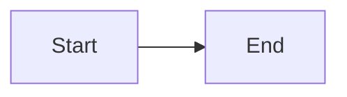

1.3 YOUR FIRST DIAGRAM

TEXT VIEW:

ACTIVE VIEW:

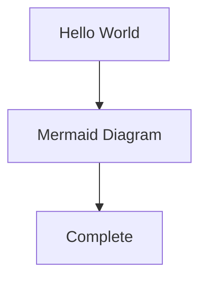

---

SECTION 2: FLOWCHARTS (GRAPH)

2.1 GRAPH DIRECTION TYPES

Flowcharts use graph followed by a two-letter direction code.

Direction TD (Top to Bottom)

TEXT VIEW:

ACTIVE VIEW:

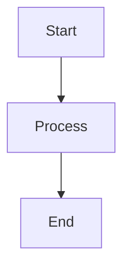

Direction LR (Left to Right)

TEXT VIEW:

ACTIVE VIEW:

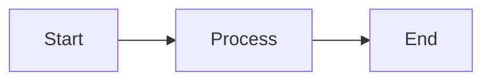

Direction RL (Right to Left)

TEXT VIEW:

ACTIVE VIEW:

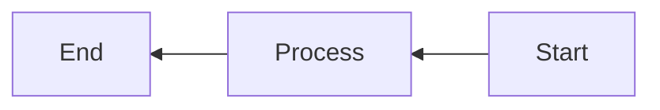

Direction BT (Bottom to Top)

TEXT VIEW:

ACTIVE VIEW:

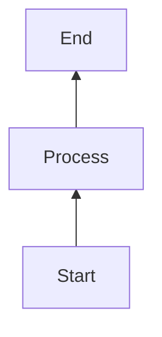

2.2 NODE SHAPES COMPLETE REFERENCE

Rectangle [Text]

TEXT VIEW:

ACTIVE VIEW:

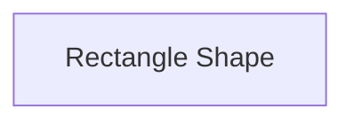

Rounded Rectangle (Text)

TEXT VIEW:

ACTIVE VIEW:

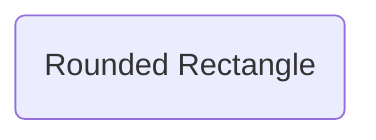

Stadium ([Text])

TEXT VIEW:

ACTIVE VIEW:


Circle ((Text))

TEXT VIEW:

ACTIVE VIEW:

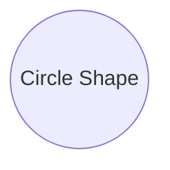

Diamond {Text}

TEXT VIEW:

ACTIVE VIEW:

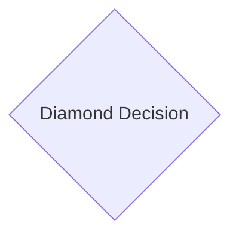

Hexagon {{Text}}

TEXT VIEW:

ACTIVE VIEW:

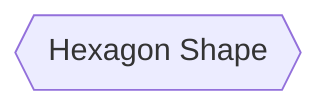

Trapezoid [/Text/]

TEXT VIEW:

ACTIVE VIEW:

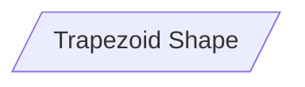

Reverse Trapezoid [\Text\]

TEXT VIEW:

ACTIVE VIEW:

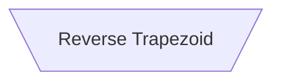

Cylinder [(Text)]

TEXT VIEW:

ACTIVE VIEW:

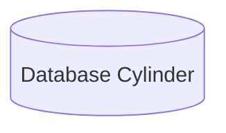

Asymmetric >Text]

TEXT VIEW:

ACTIVE VIEW:


All Shapes Together

TEXT VIEW:

ACTIVE VIEW:

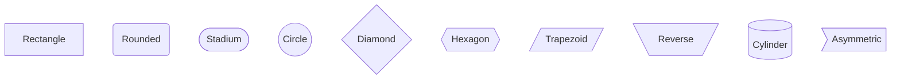

2.3 ARROW TYPES

Solid Arrow -->

TEXT VIEW:

ACTIVE VIEW:


Thick Arrow ==>

TEXT VIEW:

ACTIVE VIEW:

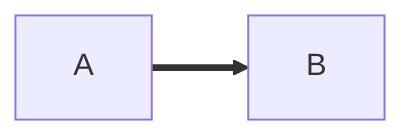

Dotted Arrow -.->

TEXT VIEW:

ACTIVE VIEW:


Arrow with Label -->|text|

TEXT VIEW:

ACTIVE VIEW:

```mermaid
graph LR
    A -->|Important| B
```

Two-Way Arrow <-->

TEXT VIEW:

ACTIVE VIEW:

```mermaid
graph LR
    A <--> B
```

Long Line ---

TEXT VIEW:

ACTIVE VIEW:

```mermaid
graph LR
    A --- B
```

All Arrow Types

TEXT VIEW:

ACTIVE VIEW:

```mermaid
graph LR
    A[Solid] --> B
    C[Thick] ==> D
    E[Dotted] -.-> F
    G[Labeled] -->|Text| H
    I[Two Way] <--> J
    K[Long] --- L
```

2.4 SUBGRAPHS (GROUPING)

TEXT VIEW:

ACTIVE VIEW:

```mermaid
graph TD
    subgraph Frontend
        A[Web App]
        B[Mobile App]
    end
    
    subgraph Backend
        C[API Gateway]
        D[Database]
    end
    
    A --> C
    B --> C
    C --> D
```

2.5 DECISION TREE EXAMPLE

TEXT VIEW:

ACTIVE VIEW:

```mermaid
graph TD
    Start([Start]) --> Input[/Enter Credentials/]
    Input --> Validate{Valid Credentials?}
    Validate -->|Yes| Dashboard[Dashboard]
    Validate -->|No| Error[Error Message]
    Error --> Input
    Dashboard --> End([End])
```

2.6 COMPLETE LOGIN FLOW

TEXT VIEW:

ACTIVE VIEW:

```mermaid
graph TD
    A[User Opens App] --> B{Has Account?}
    B -->|Yes| C[Enter Credentials]
    B -->|No| D[Sign Up Form]
    
    D --> E[Enter Details]
    E --> F[Verify Email]
    F --> C
    
    C --> G{Valid?}
    G -->|Yes| H[Login Success]
    G -->|No| I[Show Error]
    I --> C
    
    H --> J[Dashboard]
    J --> K[Use App]
```

---

SECTION 3: SEQUENCE DIAGRAMS

3.1 BASIC SEQUENCE DIAGRAM

TEXT VIEW:

ACTIVE VIEW:

```mermaid
sequenceDiagram
    Alice->>Bob: Hello!
    Bob-->>Alice: Hi there!
```

3.2 PARTICIPANTS

TEXT VIEW:

ACTIVE VIEW:

```mermaid
sequenceDiagram
    participant User
    participant Server
    participant Database
    
    User->>Server: Request
    Server->>Database: Query
    Database-->>Server: Result
    Server-->>User: Response
```

3.3 ACTIVATION (LIFELINES)

TEXT VIEW:

ACTIVE VIEW:

```mermaid
sequenceDiagram
    User->>+Server: Request
    Server->>+Database: Query
    Database-->>-Server: Result
    Server-->>-User: Response
```

3.4 NOTES

TEXT VIEW:

ACTIVE VIEW:

```mermaid
sequenceDiagram
    User->>Server: Request
    Note over User,Server: Authentication in progress
    Server-->>User: Response
    Note right of User: User receives response
```

3.5 LOOPS

TEXT VIEW:

ACTIVE VIEW:

```mermaid
sequenceDiagram
    User->>Server: Request
    loop Retry up to 3 times
        Server->>Database: Query
        Database-->>Server: Result
    end
    Server-->>User: Response
```

3.6 CONDITIONAL (ALT/ELSE)

TEXT VIEW:

ACTIVE VIEW:

```mermaid
sequenceDiagram
    User->>Server: Login Request
    alt Valid Credentials
        Server-->>User: Login Success
    else Invalid Credentials
        Server-->>User: Login Failed
    end
```

3.7 PARALLEL ACTIONS

TEXT VIEW:

ACTIVE VIEW:

```mermaid
sequenceDiagram
    User->>Server: Process Order
    
    par Payment Processing
        Server->>Payment: Charge Card
        Payment-->>Server: Confirmation
    and Inventory Check
        Server->>Warehouse: Check Stock
        Warehouse-->>Server: Available
    end
    
    Server-->>User: Order Complete
```

3.8 COMPLETE API FLOW

TEXT VIEW:

ACTIVE VIEW:

```mermaid
sequenceDiagram
    participant Client
    participant API Gateway
    participant Auth Service
    participant Database
    
    Client->>API Gateway: HTTP Request + JWT
    API Gateway->>Auth Service: Validate Token
    
    alt Token Valid
        Auth Service-->>API Gateway: User Info
        API Gateway->>Database: Query Data
        Database-->>API Gateway: Results
        API Gateway-->>Client: Response 200
    else Token Invalid
        Auth Service-->>API Gateway: Unauthorized
        API Gateway-->>Client: Error 401
    end
```

---

SECTION 4: CLASS DIAGRAMS

4.1 BASIC CLASS

TEXT VIEW:

ACTIVE VIEW:

```mermaid
classDiagram
    class Animal {
        +String name
        +int age
        +eat()
        +sleep()
    }
```

4.2 VISIBILITY SYMBOLS

TEXT VIEW:

ACTIVE VIEW:

```mermaid
classDiagram
    class User {
        +String username (public)
        -String password (private)
        #String email (protected)
        ~Date lastLogin (package)
        +login()
        -hashPassword()
        #validateEmail()
    }
```

4.3 INHERITANCE

TEXT VIEW:

ACTIVE VIEW:

```mermaid
classDiagram
    Animal <|-- Dog
    Animal <|-- Cat
    
    class Animal {
        +String name
        +eat()
    }
    
    class Dog {
        +bark()
    }
    
    class Cat {
        +meow()
    }
```

4.4 RELATIONSHIPS

TEXT VIEW:

ACTIVE VIEW:

```mermaid
classDiagram
    Car <|-- SportsCar : inheritance
    Car --> Engine : composition
    Driver ..> Car : uses
    Car "1" --> "4" Wheel : has
```

4.5 COMPLETE E-COMMERCE MODEL

TEXT VIEW:

ACTIVE VIEW:

```mermaid
classDiagram
    User <|-- Customer
    User <|-- Admin
    
    class User {
        +int id
        +String email
        +String password
        +login()
        +logout()
    }
    
    class Customer {
        +String address
        +String phone
        +addToCart()
        +checkout()
    }
    
    class Admin {
        +String role
        +manageProducts()
    }
    
    Customer "1" --> "many" Order : places
    Order "1" --> "many" OrderItem : contains
    Product "1" --> "many" OrderItem : appears in
    
    class Order {
        +int orderId
        +Date date
        +String status
        +double total
        +confirm()
        +cancel()
    }
    
    class OrderItem {
        +int quantity
        +double price
    }
    
    class Product {
        +int productId
        +String name
        +double price
        +int stock
        +updateStock()
    }
```

---
SECTION 5: STATE DIAGRAMS

5.1 BASIC STATE

TEXT VIEW:

ACTIVE VIEW:

```mermaid
stateDiagram-v2
    [*] --> Idle
    Idle --> Active : Start
    Active --> Idle : Stop
    Active --> [*]
```

5.2 COMPOSITE STATE

TEXT VIEW:

ACTIVE VIEW:

```mermaid
stateDiagram-v2
    [*] --> Online
    
    state Online {
        [*] --> Connected
        Connected --> Disconnected : Network Loss
        Disconnected --> Connected : Reconnect
    }
    
    Online --> Offline : Manual Disconnect
    Offline --> Online : Reconnect
```

5.3 CHOICE POINT

TEXT VIEW:

ACTIVE VIEW:

```mermaid
stateDiagram-v2
    [*] --> Start
    Start --> Choice
    state Choice <<choice>>
    
    Choice --> ProcessA : [condition A]
    Choice --> ProcessB : [condition B]
    Choice --> ProcessC : [else]
    
    ProcessA --> End
    ProcessB --> End
    ProcessC --> End
    End --> [*]
```

5.4 COMPLETE DOCUMENT WORKFLOW

TEXT VIEW:

ACTIVE VIEW:

```mermaid
stateDiagram-v2
    [*] --> Draft
    Draft --> Review : Submit
    
    state Review {
        [*] --> Pending
        Pending --> Approved : Approve
        Pending --> Rejected : Reject
        Approved --> [*]
        Rejected --> [*]
    }
    
    Review --> Draft : Needs Changes
    Review --> Published : Final Approval
    
    state Published {
        [*] --> Active
        Active --> Archived : Archive
        Active --> Deprecated : Mark Deprecated
        Archived --> [*]
        Deprecated --> [*]
    }
    
    Published --> [*]
```

---

SECTION 6: ENTITY RELATIONSHIP (ER) DIAGRAMS

6.1 BASIC ER DIAGRAM

TEXT VIEW:

ACTIVE VIEW:

```mermaid
erDiagram
    USER ||--o{ ORDER : places
    USER {
        int user_id PK
        string name
        string email
    }
    ORDER {
        int order_id PK
        int user_id FK
        date order_date
    }
```

6.2 CARDINALITY REFERENCE

TEXT VIEW:

ACTIVE VIEW:

```mermaid
erDiagram
    A ||--|| B : one-to-one
    C ||--o{ D : one-to-many
    E }o--|| F : many-to-one
    G }o--o{ H : many-to-many
```

6.3 COMPLETE LIBRARY DATABASE

TEXT VIEW:

ACTIVE VIEW:

```mermaid
erDiagram
    MEMBER ||--o{ LOAN : borrows
    BOOK ||--o{ LOAN : is_borrowed
    AUTHOR ||--o{ BOOK_AUTHOR : writes
    BOOK ||--o{ BOOK_AUTHOR : has
    
    MEMBER {
        int member_id PK
        string first_name
        string last_name
        string email
        string phone
        date membership_date
    }
    
    BOOK {
        int book_id PK
        string title
        string isbn
        int publication_year
        int total_copies
        int available_copies
    }
    
    AUTHOR {
        int author_id PK
        string first_name
        string last_name
        date birth_date
        string nationality
    }
    
    LOAN {
        int loan_id PK
        int member_id FK
        int book_id FK
        date borrow_date
        date due_date
        date return_date
        string status
    }
    
    BOOK_AUTHOR {
        int book_id PK,FK
        int author_id PK,FK
    }
```

---

SECTION 7: GIT GRAPHS

7.1 BASIC COMMITS

TEXT VIEW:

ACTIVE VIEW:

```mermaid
gitGraph
    commit
    commit
    commit
```

7.2 BRANCHES AND MERGES

TEXT VIEW:

ACTIVE VIEW:

```mermaid
gitGraph
    commit id: "main start"
    branch feature
    checkout feature
    commit id: "feature work"
    checkout main
    commit id: "main work"
    merge feature id: "merge feature"
```

7.3 HOTFIX WORKFLOW

TEXT VIEW:

ACTIVE VIEW:

```mermaid
gitGraph
    commit id: "v1.0.0"
    branch develop
    checkout develop
    commit id: "feature A"
    commit id: "feature B"
    
    checkout main
    branch hotfix
    checkout hotfix
    commit id: "critical fix"
    
    checkout main
    merge hotfix id: "hotfix v1.0.1"
    checkout develop
    merge hotfix id: "sync hotfix"
```

---

SECTION 8: GANTT CHARTS

8.1 BASIC GANTT

TEXT VIEW:

ACTIVE VIEW:

```mermaid
gantt
    title Simple Project
    dateFormat YYYY-MM-DD
    section Phase 1
    Task 1 : 2025-01-01, 7d
    Task 2 : after Task 1, 5d
```

8.2 COMPLETE PROJECT TIMELINE

TEXT VIEW:

ACTIVE VIEW:

```mermaid
gantt
    title Website Launch Project
    dateFormat YYYY-MM-DD
    
    section Planning
    Requirements :done, 2025-01-01, 7d
    Wireframes   :active, 2025-01-08, 5d
    Design       :2025-01-13, 10d
    
    section Development
    Frontend     :2025-01-20, 14d
    Backend      :2025-01-20, 14d
    Database     :2025-01-22, 10d
    
    section Testing
    Unit tests   :2025-02-03, 5d
    User tests   :2025-02-08, 5d
    Bug fixes    :2025-02-13, 4d
    
    section Launch
    Deploy       :2025-02-17, 2d
    Go live      :milestone, 2025-02-19, 0d
```

---

SECTION 9: PIE CHARTS

9.1 BASIC PIE CHART

TEXT VIEW:

ACTIVE VIEW:

```mermaid
pie
    "Apples" : 45
    "Bananas" : 30
    "Oranges" : 25
```

9.2 MARKET SHARE

TEXT VIEW:

ACTIVE VIEW:

```mermaid
pie
    title Smartphone Market Share 2025
    "Apple" : 28
    "Samsung" : 22
    "Xiaomi" : 12
    "Oppo" : 9
    "Vivo" : 8
    "Others" : 21
```

9.3 BUDGET ALLOCATION

TEXT VIEW:

ACTIVE VIEW:

```mermaid
pie
    title Monthly Budget
    "Rent" : 1500
    "Food" : 600
    "Transport" : 300
    "Utilities" : 200
    "Entertainment" : 200
    "Savings" : 500
```

---

SECTION 10: MIND MAPS

10.1 BASIC MIND MAP

TEXT VIEW:

ACTIVE VIEW:

```mermaid
mindmap
    root((Project))
        Planning
            Research
            Design
        Development
            Coding
            Testing
        Deployment
            Launch
            Monitor
```

10.2 COMPLETE KNOWLEDGE MAP


